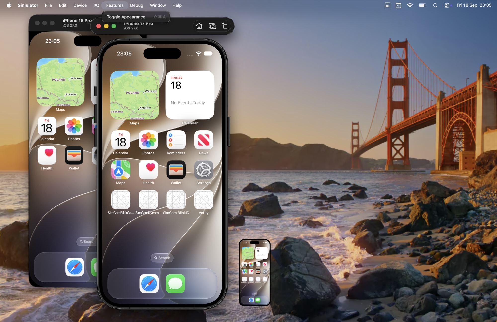
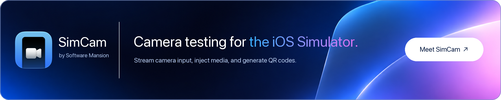

# Siniulator

**A macOS app for running and interacting with iOS simulators, bringing the utility of the original Simulator app to Xcode 27.**

With Xcode 27, [Device Hub](https://developer.apple.com/videos/play/wwdc2026/260/) replaces the Simulator app on macOS. Siniulator connects to the iOS simulators installed through Xcode and brings back the familiar ergonomics, shortcuts, and features provided by the original Simulator app. It is made for developers who prefer the original Simulator app workflow or rely on functionality missing from Device Hub.

<p align="center">
  <picture>
    <source media="(prefers-reduced-motion: reduce)" srcset="docs/assets/siniulator-multiple-devices.jpg">
    <source type="image/webp" srcset="docs/assets/siniulator-demo.webp">
    
  </picture>
</p>

<div align="center">

[](https://updates.siniulator.app/Siniulator.dmg)

<sub>Includes in-app updates.</sub>

</div>

## Sponsor

[](https://simcam.app)

## Features

- **Individual device windows** — use several simulators side by side, resize them, go full screen, or keep a window on top.
- **Compact interface** — keep the focus on the device screen, with an option to hide device bezels.
- **Precise scaling** — choose Point Accurate, Pixel Accurate, or Physical Size to view the device at the scale you need.
- **Familiar shortcuts** — control the active device with the Simulator shortcuts you already know.
- **Multi-Touch** — pinch and rotate with Option-drag, move both fingers with Option-Shift, or pinch with your trackpad.
- **Slow Animations and Shake** — slow down animations to inspect transitions, or trigger a shake gesture from the menu or a keyboard shortcut.
- **Screenshots and recordings** — capture PNGs and MP4s, then drag their previews straight into another app.
- **Keyboard and clipboard** — type with your Mac keyboard and paste text into the device.
- **Device controls** — access Home, Lock, rotation, and light/dark appearance.
- **Drag and drop** — install simulator `.app` bundles or import photos and videos by dropping them onto a device.

## Current limitations

Siniulator focuses on the core iPhone simulator workflow and does not yet cover every feature available in Device Hub or the Simulator app.

- **iPad support is incomplete** — iPad simulators can be displayed and controlled, but iPad-specific input such as pointer and mouse interaction is not fully supported.
- **Other Apple platforms are not supported yet** — tvOS, watchOS, and visionOS simulators do not currently work with Siniulator.
- **Environment simulation is limited** — location presets and routes, biometric enrollment and matching, and simulated push notifications are not available yet.
- **Advanced device controls are still missing** — this includes features such as audio input and output routing, external displays, and memory warnings.
- **Device and runtime management stays in Xcode** — use Xcode or Device Hub to create or remove simulators, install runtimes, and manage physical devices.

Want to help close one of these gaps? Pull requests are welcome.

## Installation

1. **Latest version with in-app updates** — [download the latest DMG](https://updates.siniulator.app/Siniulator.dmg).
2. **GitHub Releases** — download a prebuilt app for any released version from [GitHub Releases](https://github.com/kmagiera/Siniulator/releases).

## Working with Device Hub

Xcode 27 automatically opens Device Hub when you run an app on a simulator, and other development tools may launch it too. Siniulator displays the same running devices, so Device Hub can appear alongside it even if you prefer to use Siniulator. Quitting Device Hub can also shut down simulators it started, disconnecting them from Siniulator. The settings below let you keep those devices running and, if you use Xcode, prevent it from opening Device Hub.

To keep simulators running when Device Hub quits, close Device Hub and run:

```sh
defaults write com.apple.dt.Devices shutdownStartedDevicesOnQuit -bool false
```

To also open `devices://` links in Siniulator, go to **Siniulator → Settings… → Device Hub** and click **Make Siniulator Default**. This affects URL links, not tools that launch Device Hub directly. macOS may ask you to confirm the change.

If you run apps from Xcode, you can also stop it from opening Device Hub. Quit Xcode, then run:

```sh
defaults write com.apple.dt.Xcode DVTiPhoneSimulatorAlwaysLaunchInCoreSimulatorSession -bool true
```

With this Xcode setting enabled, **boot the target simulator in Siniulator before pressing Run**. Otherwise, Xcode may shut it down when you press Stop. You can skip this setting if you do not run apps from Xcode.

These private preferences were tested with Xcode 27.0 and may change in future versions.

## Building from source

Requires macOS 14 or later and a full Xcode 26 or later installation to compile the Icon Composer app icon. Open Xcode once to install its components and select it with `xcode-select` if you have multiple installations.

Build and open a release version:

```sh
git clone https://github.com/kmagiera/Siniulator.git
cd Siniulator
./scripts/build-app.sh
open build/Siniulator.app
```

Open `Package.swift` in Xcode to edit and debug the project. Use `./scripts/build-app.sh debug` for a debug build. Running the app requires an installed iOS simulator runtime.

Source builds are signed ad hoc and need no Apple account or certificates. In-app updates stay disabled unless an update signing public key is configured. To build signed, notarized releases and generate the Sparkle feed, see [Releasing](docs/releasing.md).

## Contributing

Make it yours. Bug reports, feature ideas, and pull requests are welcome — [open an issue](https://github.com/kmagiera/Siniulator/issues) to share what you would like to change.

Run `swift test` for unit tests. See [Testing](docs/window-testing.md) for script, simulator integration and native window checks, and [Render benchmark](docs/render-benchmark.md) for performance regression checks.

## License

[MIT](LICENSE). See [third-party notices](THIRD_PARTY_NOTICES.md) for acknowledgements.

## Disclaimer

Siniulator is an independent open-source project. It is not affiliated with, endorsed by, or sponsored by Apple Inc.

Siniulator does not bundle or redistribute Apple frameworks, simulator runtimes, or device bezel assets. It uses your local Xcode installation and the simulator components installed through Xcode to connect to iOS simulators and load device bezel assets at runtime.
